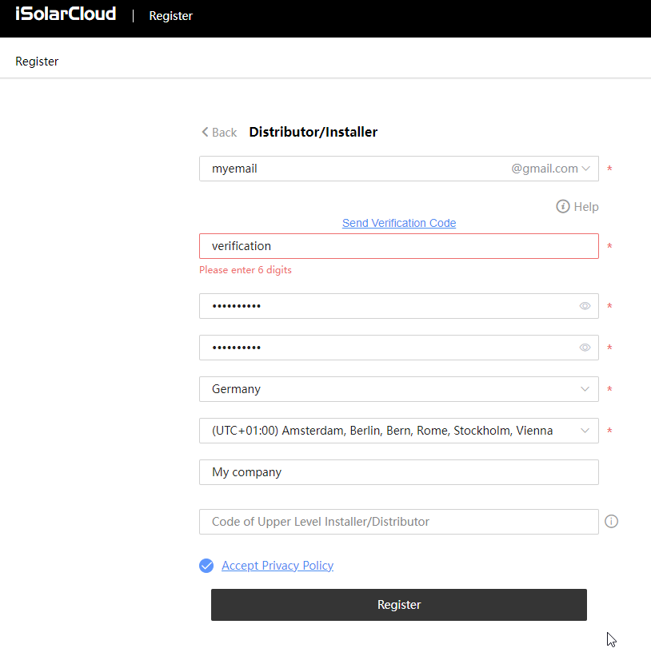

# Sungrow Knowledge Base
## Winet-S Admin Access
The derfault credentials for admin access:
* username: admin
* password: pw8888

## Get Installer Access to Inverter Parameters
To get installer access to inverter parameters a isolarcloud.com installer accound has to be created.

1. Register a new account and select "Distributor/Installer".

 
2. Enter email/password/... and leave "Code of Upper Level Installer/Distributor" empty.

 
3. Log in with your customer/end user account.
4. Share the system with your previously created installer account.

 
5. Log in with your installer account and accept the share.

